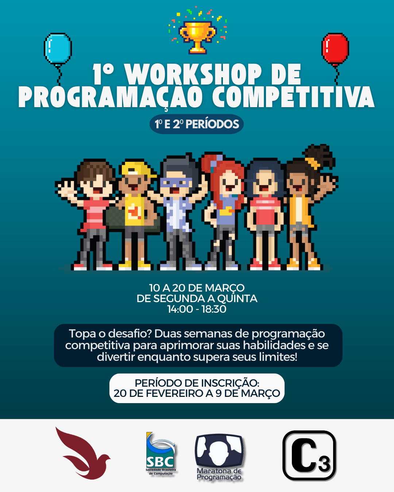

# I-Workshop-Programação Competitiva

Questões utilizadas durante as aulas, contests e práticas do <b>I Workshop de Programação Competitiva</b>

## Lista de Conteúdos:

1. Lógica Matemática e Condicionais
2. Looping, Modularização e Recursão
3. Vetor, String e Matriz
4. Busca e Ordenação
5. Pilha e Fila

## Instrutores:

- Eduardo Braga
- Henrique Franca
- Isabela Medeiros
- Isadora Xavier
- Júlia Vilela
- Maria Luiza Ribeiro 
- Victor Hugo Silva